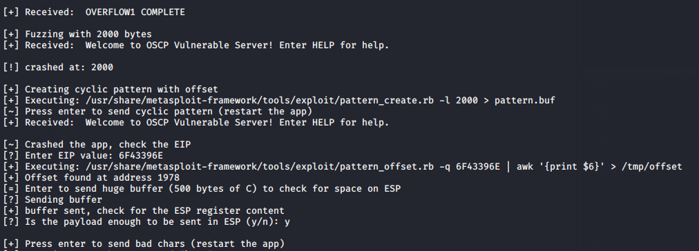
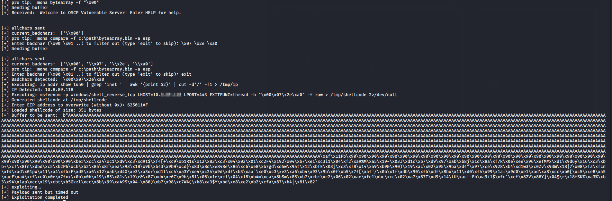

# Buffer Overflow

This tool is created in order to allow penetration testers / researchers to quickly test out simple buffer overflows, without having to write a line of code.

The user will only need to enter bad characters to filter out, as well as the EIP address to overwrite to, and the tool will generate buffer string to return a reverse shell.

`buffer-overflow.py`: the tool that allows rapid exploitation of the target buffer overflow service.

`exploit-template.py`: the poc exploit template.

## Disclaimer
I created the tool and used it in the OSCP exam and passed. This only helps you quickly exploit the target, and tells you the information necessary (such as offset, badchars, etc) to create a working PoC. It does not write the PoC for you.

**Use it at your own discretion**

## Features
- fuzz the application
- send cyclic pattern
- query exact offset
- iteratively send badchars array
- generating shell code based on the interface ip and provided `--rport` value
- send the exploit string and get a reverse shell

## Usage
```
Buffer overflow exploit testing tool

Required Parameters:
  --ip IP               target ip address
  --port PORT           target port to exploit

optional arguments:
  -h, --help            show this help message and exit
  --offset OFFSET       eip offset if already known, this will skip offset finding
  --prefix PREFIX       prefix of the string to send (e.g. "OVERFLOW1 ")
  --suffix SUFFIX       suffix of the string to send (e.g. "\r\n")
  --rport RPORT         reverse shell port (default: 443)
  --interface INTERFACE the interface to use (default: "tun0")
  --msf MSF             metasploit framework directory to use
  --noreceive           use if the program doesn't send an initial response on connect
  --newline             add newline character to the end of the sent data
  --step STEP           step increment for fuzzing, default 100, try increasing if EIP is not overwritten
```

Note: there will be some edge cases where the application crashes, but the EIP is not overwritten with 0x41. In this kind of case, try increasing the `--step` value to cover the gap between crashing offset and EIP overwriting offset.







## Contributors
- @cY83rR0H1t: testing and screenshots
- @AliceGrey: fixing wording, adding new features

